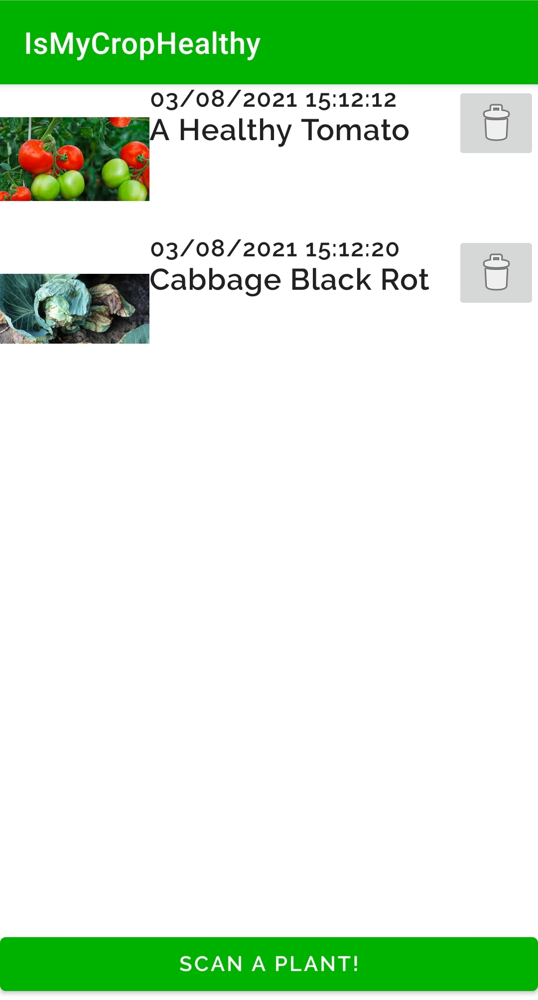
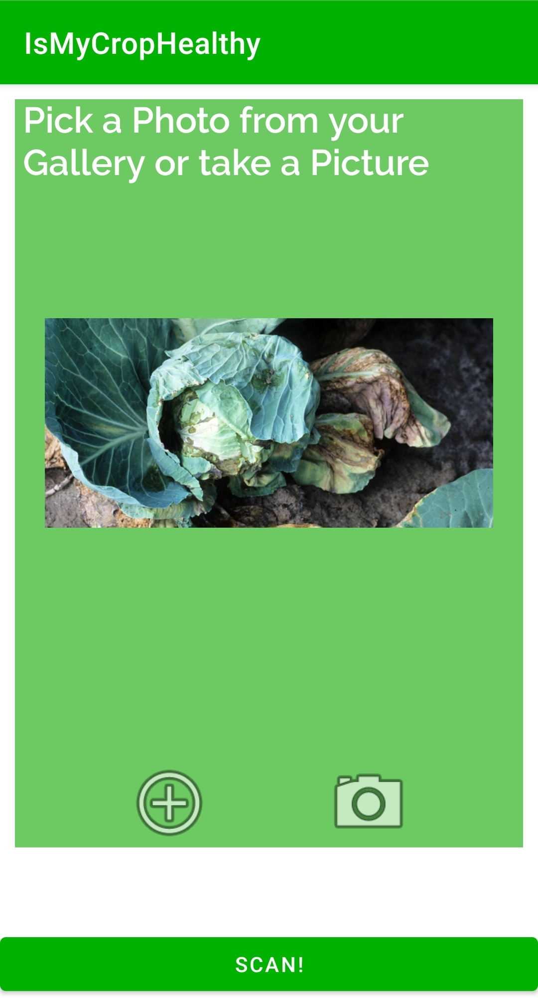
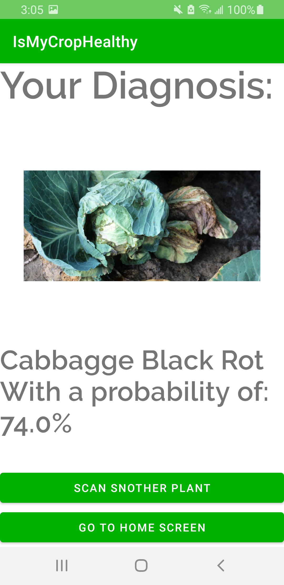

# Is-My-Crop-Healthy-App
An android app that uses machine learning to scan a crop's photo for diseases
 

 
 

This app was developed for my family members so that they could easily diagnose their crops. It is a very useful app for people who are tending to vegetable gardens, especially with Spring around the corner. 

## Technologies used
<ul>
<li>A Neural network devloped by Google using the MobileNet Architecture : https://tfhub.dev/agripredict/disease-classification/1</li>
<li>SqlLite Via the Room Abstraction Layer for local data persistence</li>
</ul>

## Improvements for the future
<ul>
<li>Develop and train a transfer learning model so that the app can recognize more diseases</li>
<li>Might take out storing images in SqlLite since it consumes alot of memory. The trade off will be a less aestically pleasing home feed</li>
<li>Multithreading using RxJava</li>
</ul>